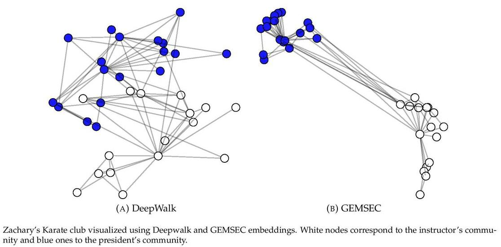

GEMSEC - Graph Embedding with Self Clustering
============================================
<p align="justify">
GEMSEC is a graph embedding algorithm which learns an embedding and clustering jointly. The procedure places nodes in an abstract feature space where the vertex features minimize the negative log likelihood of preserving sampled vertex neighborhoods while the nodes are clustered into a fixed number of groups in this space. GEMSEC is a general extension of earlier work in the domain as it is an augmentation of the core optimization problem of sequence based graph embedding procedures and it is agnostic of the neighborhood sampling strategy (first/second-order random walks).
  
The second-order random walks sampling methods were taken from the reference implementation of [Node2vec](https://github.com/aditya-grover/node2vec).
</p>
<p align="center">
  
</p>

This repository provides a reference implementation for GEMSEC as described in the paper:
> GEMSEC: Graph Embedding with Self Clustering.
> [Benedek Rozemberczki](http://homepages.inf.ed.ac.uk/s1668259/), [Ryan Davies](https://www.inf.ed.ac.uk/people/students/Ryan_Davies.html), [Rik Sarkar](https://homepages.inf.ed.ac.uk/rsarkar/) and [Charles Sutton](http://homepages.inf.ed.ac.uk/csutton/) .
> arXiv, 2018.
>https://arxiv.org/abs/1802.03997

### Table of Contents

1. [Citing](#citing)  
2. [Requirements](#requirements)
3. [Datasets](#datasets)  
4. [Logging](#logging)  
5. [Options](#options) 
6. [Examples](#examples)  
7. [Related Papers](#related-papers)  

### Citing

If you find GEMSEC useful in your research, please consider citing the following paper:

>@misc{1802.03997,    
       author = {Benedek Rozemberczki and Ryan Davies and Rik Sarkar and Charles Sutton},    
       title = {GEMSEC: Graph Embedding with Self Clustering},   
       year = {2018},    
       eprint = {arXiv:1802.03997}
       }

### Requirements

The codebase is implemented in Python 3.5.2 | Anaconda 4.2.0 (64-bit). Package versions used for development are just below.
```
networkx          1.11
tqdm              4.19.5
numpy             1.13.3
pandas            0.20.3
tensorflow-gpu    1.12.0
jsonschema        2.6.0
texttable         1.5.1
python-louvain    0.11
```

### Datasets

The code takes an input graph in a csv file. Every row indicates an edge between two nodes separated by a comma. The first row is a header. Nodes should be indexed starting with 0. Sample graphs for the `Facebook Politicians` and `Facebook Companies` datasets are included in the  `data/` directory.

### Logging

The models are defined in a way that parameter settings and cluster quality is logged in every single epoch. Specifically we log the followings:

```
1. Hyperparameter settings.     We save each hyperparameter used in the experiment.
2. Cost per epoch.              Embedding, clustering and regularization cost are stored depending on the model type.
3. Cluster quality.             Measured by modularity. We calculate it both for the classical and neural clusterings per epoch.
4. Runtime.                     We measure the time needed for optimization and data generation per epoch -- measured by seconds.
```

### Options

Learning of the embedding is handled by the `src/embedding_clustering.py` script which provides the following command line arguments.

#### Input and output options

```
  --input                STR      Input graph path.                              Default is `data/politician_edges.csv`.
  --embedding-output     STR      Embeddings path.                               Default is `output/embeddings/politician_embedding.csv`.
  --cluster-mean-output  STR      Cluster centers path.                          Default is `output/cluster_means/politician_means.csv`.
  --log-output           STR      Log path.                                      Default is `output/logs/politician.log`.
  --assignment-output    STR      Node-cluster assignment dictionary path.       Default is `output/assignments/politician.json`.
  --dump-matrices        BOOL     Whether the trained model should be saved.     Default is `True`.
  --model                STR      The model type.                                Default is `GEMSECWithRegularization`.
```


#### Random walk options

```
  --walker   STR         Random walker order (first/second).              Default is `first`.
  --P        FLOAT       Return hyperparameter for second-order walk.     Default is 1.0
  --Q        FLOAT       In-out hyperparameter for second-order walk.     Default is 1.0.
```

#### Skipgram options

```
  --dimensions               INT        Number of dimensions.                              Default is 16.
  --random-walk-length       INT        Length of random walk per source.                  Default is 80.
  --num-of-walks             INT        Number of random walks per source.                 Default is 5.
  --window-size              INT        Window size for proximity statistic extraction.    Default is 5.
  --distortion               FLOAT      Downsampling distortion.                           Default is 0.75.
  --negative-sample-number   INT        Number of negative samples to draw.                Default is 10.
```

#### Model options

```
  --initial-learning-rate   FLOAT    Initial learning rate.                                        Default is 0.001.
  --minimal-learning-rate   FLOAT    Final learning rate.                                          Default is 0.0001.
  --annealing-factor        FLOAT    Annealing factor for learning rate.                           Default is 1.0.
  --initial-gamma           FLOAT    Initial clustering weight coefficient.                        Default is 0.1.
  --lambd                   FLOAT    Smoothness regularization penalty.                            Default is 0.0625.
  --cluster-number          INT      Number of clusters.                                           Default is 20.
  --overlap-weighting       STR      Weight construction technique for regularization.             Default is `normalized_overlap`.
  --regularization-noise    FLOAT    Uniform noise max and min on the feature vector distance.     Default is 10**-8.
```

### Examples

The following commands learn a graph embedding and cluster center and writes them to disk. The node representations are ordered by the ID.

Creating a GEMSEC embedding of the default dataset with the default hyperparameter settings. Saving the embedding, cluster centres and the log file at the default path.

```
python src/embedding_clustering.py
```
Creating a DeepWalk embedding of the default dataset with the default hyperparameter settings. Saving the embedding, cluster centres and the log file at the default path.

```
python src/embedding_clustering.py --model DeepWalk
```

Turning off the model saving.

```
python src/embedding_clustering.py --dump-matrices False
```

Creating an embedding of an other dataset the `Facebook Companies`. Saving the output and the log in a custom place.

```
python src/embedding_clustering.py --input data/company_edges.csv  --embedding-output output/embeddings/company_embedding.csv --log-output output/cluster_means/company_means.csv --cluster-mean-output output/logs/company.json
```

Creating a clustered embedding of the default dataset in 32 dimensions, 20 sequences per source node with length 160 and 10 cluster centers.

```
python src/embedding_clustering.py --dimensions 32 --num-of-walks 20 --random-walk-length 160 --cluster-number 10
```

### Related papers


